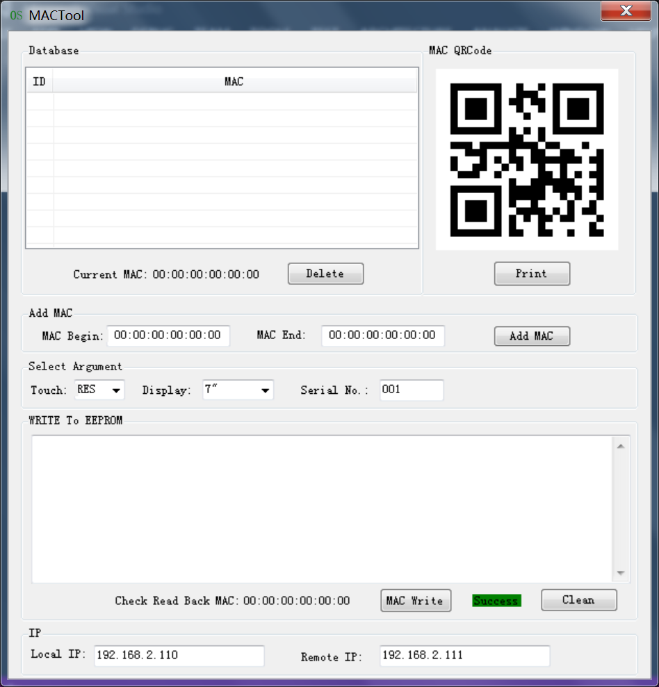

基于Linux的平台，烧录MAC地址的工具。将MAC地址写入EEPROM中。

#### SQLiteMACO

MAC地址的格式是按照17个字节写入eeprom中

#### SQLiteMACW

MAC地址的格式是按照6个字节写入eeprom中

#### 操作说明

* 工具使用了telnet协议，所以Linux的板子需要运行telnet的服务端。

* 文件的上传需要使用tftp32软件，自行上网下载。打开tftp32软件，切换tftp上传文件的路径，指定到编译生成的可执行文件的路劲。工具使用的时候，会将生成的可执行文件路径eeprom.bin文件上传到板子上，并写入eeprom中。

* 需要指定本地的IP地址和板子的IP地址。

#### 显示效果

